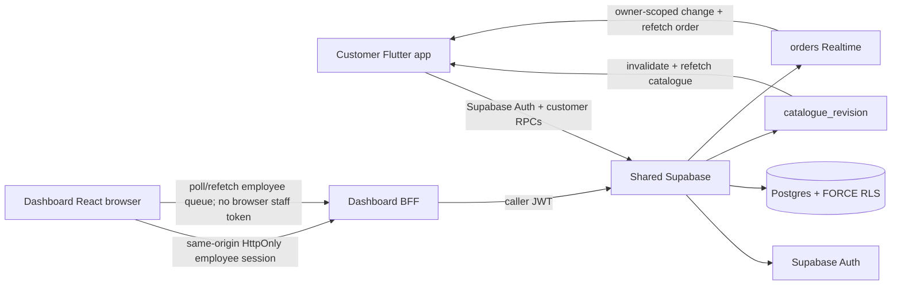
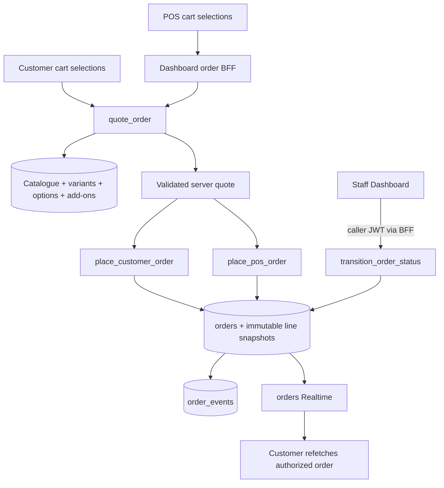

# AIDA Café Architecture

Updated: 2026-08-23



## Repository/runtime topology

- Customer: `Hermann-33/Aida_System`, Flutter/Dart/Riverpod, default branch `master`.
- Dashboard/Admin/POS: `Hermann-33/Aida_System-Dashboard`, React/TypeScript/Vite, default branch `main`.
- Shared backend: Supabase project `Aida System`, ref `eswovqxqzfevcdwwcmuh`.
- Canonical executable Supabase migrations live only in the customer repository `supabase/` workspace unless a future accepted ADR changes ownership.

## Identity / employee authority

Supabase Auth owns authentication. Trusted employee/Admin authorization lives in `user_profiles.app_role` plus `disabled_at`; customer membership identity/code lives in `members`.

Dashboard employee credentials remain behind the ADR-0008 same-origin BFF. React receives HttpOnly cookies, while the BFF validates the employee and forwards only that caller JWT to Supabase. No service-role credential or browser-readable employee bearer token is part of the architecture.

Customer Flutter uses public/publishable Supabase configuration and customer-scoped RLS/RPC boundaries.

## Shared catalogue and modifier architecture

ADR-0009 makes Supabase Postgres the catalogue authority.

Core resources:

```text
catalogue_categories
catalogue_items
catalogue_item_variants
catalogue_item_addons
catalogue_option_groups
catalogue_option_values
catalogue_item_option_values
catalogue_revision
catalogue_audit_events
```

`catalogue_items.kind` distinguishes normal products from reusable add-ons. `catalogue_items.is_drink` marks products that consume option groups.

Current standard reusable drink groups:

```text
Temperature: Hot | Iced
Sweetness: Regular | Less sweet | Least sweet
```

Per product, Admin/Owner can configure option label override, price delta, availability, default and order. Required groups must have at least one available option and exactly one available default.

Compatible add-ons are normalized links from product to add-on. Customer browsing hides `kind=addon` rows/categories, but the same catalogue rows remain available to per-product customization.

Customer reads use `get_catalogue()` under RLS. Dashboard Admin mutations use the accepted catalogue BFF/RPC boundary with the caller JWT. `catalogue_revision` is invalidation only.

## Authoritative quote/order boundary

ADR-0010 keeps the same Supabase project authoritative for customer and POS order pricing, persistence, scheduling and fulfilment.



Clients submit only IDs, quantities, notes and fulfilment intent. A line may contain:

```text
itemId
variantId
optionValueIds[]
addOnIds[]
quantity
note
```

Clients are not authority for labels, option/add-on prices, unit prices, totals, customer/member identity, order numbers, status or payment state.

`quote_order(jsonb)` validates product publication/availability, variants, compatible add-ons and per-drink option ownership/availability before deriving totals. The current quote contract is `pricingVersion=2`:

```text
base + variant + selected/default options + compatible add-ons
```

If an older client omits a required option group, the live quote function resolves the configured available default. This is a server-side compatibility behavior, not client authority.

## Immutable commercial snapshots

Server-owned order resources include:

```text
orders
order_lines
order_line_addons
order_line_options
order_events
```

`order_lines.option_total_sen` snapshots the accepted option-price contribution.

`order_line_options` snapshots selected group/value IDs, codes, customer-facing labels and accepted price deltas. Historical orders therefore remain stable after Admin later renames, reprices or disables an option.

Placement remains idempotent through `clientRequestId`.

## Customer modifier flow

```text
Menu product
 -> ItemDetailScreen
 -> variant selection
 -> Temperature/Sweetness from catalogue
 -> compatible add-ons from catalogue
 -> local line configuration
 -> Add to cart
 -> return to Menu
 -> cart estimate
 -> quote_order
 -> server total
 -> place_customer_order
```

Cart identity/equivalence includes option/add-on IDs so two differently customized copies remain separate configurations.

Customer-facing immediate pickup copy is `Now`; the wire/backend value remains `asap`.

## Dashboard Admin / POS modifier flow

```text
Admin Menu editor
 -> isDrink + option label/delta/availability/default
 -> compatible add-on checkboxes
 -> same-origin BFF
 -> save_catalogue_item
 -> revision bump

POS product
 -> variants
 -> required Temperature/Sweetness
 -> optional compatible add-ons
 -> local estimate only
 -> order BFF
 -> quote_order authoritative total
```

Dashboard preview remains read-only. Staff POS capability does not grant Admin catalogue mutation.

## Scheduling / operational queue

Current live scheduling policy remains:

```text
Asia/Kuala_Lumpur
15-minute minimum lead
15-minute preparation lead
15-minute slot interval
7-day horizon
```

Scheduled orders snapshot immutable `prepareAt`. Backend snapshots derive `scheduleState = future | due | overdue | null`; no timer/client auto-transitions fulfilment state.

The Dashboard operational queue remains Active/Scheduled/Ready/History and uses trusted `scheduleState`. Customer Schedule UI keeps the accepted tactile wheel over `derivePickupSlots(OrderingPolicy)`.

## Realtime boundary

`supabase_realtime` publishes:

- `catalogue_revision` — catalogue invalidation;
- `orders` — authorized order-header invalidation.

Customer clients can use their Supabase session and refetch authorized data. Dashboard React does not expose the HttpOnly employee token for direct Supabase Realtime; it polls/refetches same-origin BFF endpoints.

## Validation boundary

TASK-MENU-CUSTOMIZATION-001 closeout is recorded in:

`docs/context/MENU_CUSTOMIZATION_2026-08-23.md`

Executable evidence:

- Customer: `flutter analyze` PASS, 55/55 tests PASS, exact-size UI/golden QA PASS;
- Dashboard: lint/typecheck/build PASS, Vitest 129/129, Playwright 10/10, desktop UI/theme QA PASS;
- live Supabase: zero invalid required drink groups, intended grants/RLS confirmed, no new security WARN/ERROR.

## Explicitly separate authority

Payment settlement/refunds, loyalty, inventory, promotions/discounts, tax/accounting/reporting, branch scheduling/capacity, branch-scoped operations, terminal/sales-point lifecycle, shifts/cash reconciliation, delivery and hosted production remain separate trusted domains.


## Branch / operational-scope architecture

ADR-0011 introduces a trusted operational parent for future terminals, shifts, inventory and reporting.

```text
branches
  -> employee_branch_assignments
  -> orders.branch_id
```

Current authority:

- `BR-MAIN — Main Café` is the single active default branch;
- every order carries immutable trusted `branch_id`;
- ordinary staff may read/transition only orders from assigned branches;
- Admin/Owner remain global operational roles;
- customer ownership rules are unchanged;
- existing customer/POS placement requests resolve the active default branch server-side and do not yet send trusted branch IDs.

The Dashboard employee BFF reads branch assignments with the caller JWT and does not invent branch scope in React.

Explicit branch selection, sales points/terminals, shifts, branch inventory, branch hours/closures/capacity and branch-scoped reporting are not part of this foundation.
