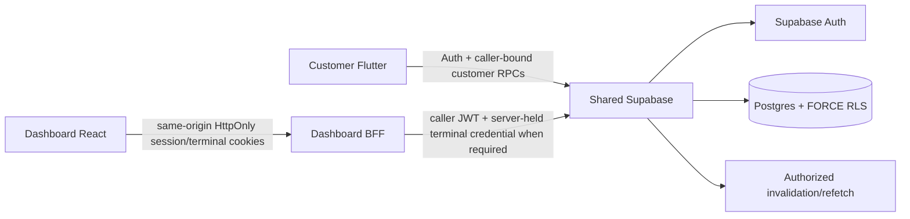

# AIDA Café Architecture

Updated: 2026-09-16

## System topology



AIDA is one product across `Hermann-33/Aida_System`, `Hermann-33/Aida_System-Dashboard`, and Supabase project `eswovqxqzfevcdwwcmuh`. Canonical executable migrations live only in `Aida_System/supabase/migrations/`.

## Trusted authority through Phase 8 implementation

Supabase/server owns authenticated identity, trusted role/disabled state, membership, employee branch scope, operational topology, terminal credential validity, shift/cash state, tender/payment classification, catalogue/pricing, branch scheduling/capacity, inventory/recipes/depletion, privacy/account deletion, loyalty/reward/voucher state, generalized promotion configuration/evaluation, persisted commercial snapshots, and the source facts used by Phase 8 reporting/reconciliation/audit projections.

Phase 8 does not introduce a second mutation authority. Reporting is derived read authority over persisted Phase 1–7 facts.

Dashboard privileged operations stay behind the same-origin BFF. Employee access/refresh and terminal credentials are HttpOnly; the BFF forwards the caller JWT and publishable key. No normal flow uses a service-role credential or browser-readable reusable employee bearer/terminal secret. Preview fixtures are never backend authority.

## Authority chain

```text
Phase 1: branch -> sales point -> terminal -> employee branch scope -> POS attribution
Phase 2: employee + terminal -> shift -> POS order / append-only cash ledger
Phase 3: customer -> privacy preferences / whole-account deletion -> anonymized retained history
Phase 4: branch calendar/policy -> pickup slot capacity -> authoritative quote/place
Phase 5: recipe -> branch stock -> transactional depletion / cancellation reversal
Phase 6: member -> loyalty ledgers/balances -> reward/voucher -> voucher discount / one-time consumption
Phase 7: promotion config -> eligibility/stacking/usage -> quote/place -> immutable promotion application snapshot
Phase 8: trusted Phase 1–7 facts -> read-only operational summary / transactions / audit projections
```

## Phase 7 promotion architecture

Trusted resources include `promotions`, `promotion_branches`, `promotion_items`, `promotion_variants`, `promotion_addons` and `promotion_order_applications`. All six are live with RLS + FORCE RLS and no direct anon/authenticated CRUD grants.

Promotion configuration supports fixed or percentage discounts, optional maximum discount, active windows, minimum subtotal, priority, exclusive/stackable behavior, explicit voucher coexistence, member requirements and global/per-member usage limits. Catalogue scope is validated so product scope references products and add-on scope references add-ons.

`quote_order` computes the authoritative base quote and optional voucher adjustment, then automatically evaluates eligible active promotions. Clients do not submit accepted promotion IDs or discount values. The quote returns distinct `voucherDiscountSen`, `promotionDiscountSen`, total `discountSen`, `totalSen`, voucher snapshot and promotion snapshots.

Placement locks candidate promotion rows in deterministic order before re-evaluating the quote. This stabilizes usage counts and prevents concurrent orders from oversubscribing a final promotion use. Accepted promotions are inserted into `promotion_order_applications` as immutable code/name/type/value/discount/priority/stacking/voucher-coexistence snapshots and must reconcile to the order's authoritative discount.

Voucher and promotion discounts remain separate components even though `orders.discount_sen` stores the accepted total discount.

## Phase 8 reporting architecture

Canonical migration `20260916100000_create_reporting_audit_authority.sql` adds no report table. It exposes three read-only public caller surfaces:

```text
public.get_admin_reporting_summary(jsonb)
public.get_admin_transaction_report(jsonb)
public.get_admin_audit_events(jsonb)
```

The public functions are `SECURITY INVOKER`, authenticated-only and caller-bound through guarded private implementations. Private implementations are `SECURITY DEFINER` with empty `search_path` and require the authenticated Admin/Owner actor.

The reporting summary derives accepted-order value, order counts/statuses, separate voucher/promotion discounts, paid POS cash, unpaid accepted order value, branch/sales-point/product dimensions, shift/cash reconciliation, loyalty/application aggregates and inventory movement aggregates.

The transaction projection returns source-backed order/topology/commercial detail with explicit semantics that `totalSen` is accepted order value, not processor settlement. Refund data is intentionally unavailable until Phase 9.

The audit projection unions durable Phase 1–7 facts such as order events, cash movements, inventory movements, loyalty ledgers, voucher/promotion applications and durable shift lifecycle events. It declares that historical configuration edits and repeated lock/resume transitions that were not event-sourced before Phase 8 are not fabricated.

## Dashboard reporting boundary

Production reporting pages now consume the Phase 8 caller-bound BFF endpoints:

```text
/admin
/admin/reports/sales
/admin/reports/transactions
/admin/system/audit
```

The Dashboard uses strict response parsers before rendering. Production reporting no longer treats synthetic trend percentages, fake payment mixes, sample refund values/reasons, sample audit rows or preview leaderboards as authoritative facts. Preview mode remains fixture-only and a blocking browser regression proves the four reporting pages issue no privileged reporting requests.

## Live deployment record

Phase 7 canonical migrations `20260915100000`, `20260915101000`, `20260915101100` are applied as live versions `20260915120917`, `20260915121057`, `20260915121119`.

Phase 8 canonical migration `20260916100000_create_reporting_audit_authority.sql` is applied as live migration-history version `20260916013938_create_reporting_audit_authority`.

The project is `ACTIVE_HEALTHY`. Fresh post-Phase-8 security advisors produced no Phase 8-created WARN/ERROR; the pre-existing leaked-password-protection Auth warning remains. Fresh performance advisors report INFO unused-index observations only and no Phase 8-created warning/error.

## Client architecture

Customer Flutter continues to parse authoritative quote/order commercial snapshots fail-closed. Phase 8 introduces no customer mutation surface.

Dashboard/POS continues to use caller-bound same-origin BFF routes. `/admin/rewards/campaigns` manages Phase 7 promotions; Phase 8 report routes are read-only and use the same employee HttpOnly session/caller JWT boundary.

## Privacy and commercial retention

Whole-account deletion removes customer-owned loyalty state and detaches identifying customer/member references from retained order/application history while preserving legitimate non-identifying commercial facts. Phase 8 reports do not expose customer PII merely because it exists in source tables; transaction detail only exposes the bounded operational/commercial fields defined by the report contract.

## Realtime and payment boundaries

Customer Realtime is authorized invalidation followed by refetch. Dashboard privileged data does not expose employee tokens for direct Realtime. Cash/unpaid remains internal POS tender authority. External payment authorization/capture/refunds/processor settlement remain Phase 9.

## Security invariants

- authorization never trusts customer-editable Auth metadata or preview state;
- no service-role/secret credential is shipped to Flutter/browser code;
- employee JWT and terminal credential remain HttpOnly for Dashboard live flows;
- branch/terminal/shift/scheduling/inventory/loyalty/promotion/commercial authority is server-derived;
- direct client mutation of protected operational/loyalty/promotion tables is denied;
- reports are read projections and never become mutation authority;
- report filters cannot create broader role authority;
- stock depletion is transactional and non-negative;
- voucher ownership/status/expiry/discount and promotion eligibility/usage are revalidated at placement;
- promotion usage-limit contention serializes rather than oversubscribing;
- customer self-deletion cannot target another user and does not erase staff/POS audit identity;
- retained customer history loses identifying customer/member/Auth references and customer-authored free text/request digest.

Phase 8 implementation, repository validation and live deployment/advisors are complete. The formal Phase 8 verdict remains `PARTIAL` only until the required independent/Astra audit boundary is completed or explicitly accepted. Phase 9–10 remain frozen until that gate is resolved.
