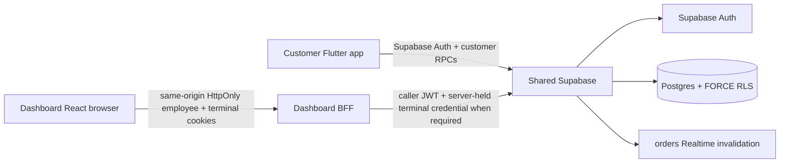

# AIDA Café Architecture

Updated: 2026-09-15

## System topology



AIDA is one product across `Hermann-33/Aida_System`, `Hermann-33/Aida_System-Dashboard`, and Supabase project `eswovqxqzfevcdwwcmuh`. Canonical executable migrations live only in `Hermann-33/Aida_System/supabase/migrations/`.

## Trusted authority through the current Phase 5 boundary

Supabase/server owns authenticated identity, trusted application role/disabled state, membership identity, employee branch scope, branch/sales-point/terminal topology, terminal credential validity, shift state, cash reconciliation, tender/payment classification, catalogue/commercial pricing, persisted order state, privacy/account deletion, branch scheduling/capacity, inventory balances, recipes and stock depletion/reversal.

Dashboard privileged operations stay behind the same-origin BFF. Employee access/refresh and terminal credentials are HttpOnly; the BFF forwards the caller JWT; no service-role secret or browser-readable employee bearer token is used. Preview fixtures are never backend authority.

Customer Flutter uses publishable Supabase configuration and customer-scoped RPC/RLS boundaries. Customer-editable Auth metadata is never authorization authority.

## Phase 1 — operational topology

Trusted chain:

```text
branch -> sales point -> terminal -> employee branch scope -> POS order attribution
```

The browser does not choose trusted operational IDs for live placement. Manager-issued one-time enrolment activates a terminal; the credential is server-held by the Dashboard BFF; revocation or branch-scope removal invalidates authority. Accepted POS topology attribution is immutable.

## Phase 2 — shift and cash authority

```text
branch -> sales point -> terminal -> employee -> shift -> POS order / cash ledger
```

`public.shifts` and append-only `public.cash_movements` own shift/cash facts. New POS placement requires a matching open shift. Opening float and movements use integer sen; expected cash and closing variance are server-derived; non-zero variance close requires Admin/Owner authority. Persisted shift/tender/payment attribution is protected from ordinary mutation. Phase 2 tender semantics remain `cash | unpaid`; external processor settlement/refunds remain deferred.

## Phase 3 — customer privacy and account requirements

Trusted resources/contracts:

```text
public.customer_privacy_preferences
public.orders.customer_deleted_at
public.delete_own_account()
public.get_my_privacy_preferences()
public.save_my_privacy_preferences(...)
```

Customer deletion is caller-bound to `auth.uid()` and accepts no target user ID. Retained customer commercial history is anonymized: customer/member/Auth identity and customer-authored retained free text are removed while order/product/price/topology/payment facts remain. Staff/POS audit identity is preserved. Marketing preference defaults off. Phase 3 adds no tracking/advertising SDK or new protected device permission.

## Phase 4 — branch scheduling and pickup authority

Trusted chain:

```text
active branch
 -> branch timezone
 -> weekly service windows / dated exceptions
 -> ASAP or scheduled policy
 -> lead time / scheduling horizon / slot interval
 -> persisted scheduled-order capacity
 -> authoritative quote and order placement
```

Customer branch selection is intent only and is server-validated. POS branch authority remains terminal/open-shift derived. The server derives `prepare_at`, validates dated closures/opening windows and scheduling horizon/lead time, and serializes scheduled capacity checks using transaction-scoped locking before accepting an order. Customer checkout consumes authoritative branch/slot RPCs and fails closed when live availability cannot be obtained. Dashboard scheduling administration remains behind the caller-JWT BFF.

## Phase 5 — inventory and recipes

Phase 5 is the current implementation boundary.

Trusted chain:

```text
catalogue item / variant / add-on
 -> active recipe
 -> recipe components
 -> branch inventory
 -> append-only stock movements
 -> quote sufficiency check
 -> transactional placement depletion
 -> cancellation reversal
```

### Inventory representation

`public.inventory_items` defines globally addressable stock inputs using a base unit of `g`, `ml`, or `unit`. Physical quantities are stored as signed integer milli-units; no floating-point inventory arithmetic is authoritative.

`public.branch_inventory` stores one current non-negative on-hand balance per branch + inventory item. It is a derived current balance maintained only through trusted mutation helpers.

`public.inventory_movements` is append-only audit history for receiving, waste, manual adjustment, order consumption and cancellation reversal. Accepted order consumption is order/line attributed. Cancellation produces exactly-once compensating reversal movements; it does not rewrite historical consumption rows.

### Recipe representation

`public.recipes` maps catalogue items, optionally a specific variant, to active recipe definitions. `public.recipe_components` maps each recipe to positive integer milli-unit requirements.

Recipe control is opt-in. A catalogue item/add-on without an active recipe remains orderable and consumes no inventory. Once an active recipe exists, every active component becomes authoritative stock input. Exact variant recipes take precedence over item-default recipes.

### Quote and placement semantics

Quote performs an inventory sufficiency check using the same server-validated branch authority from Phase 4. It does not reserve stock.

Order placement remains final authority. Order-line and add-on insert triggers perform atomic non-negative branch-stock decrements inside the same database transaction. If any component cannot be consumed, the order transaction fails; concurrent orders cannot both consume the same final stock. Client stock estimates never become authority.

### Privileged mutation boundary

Admin/Owner browser requests use the same-origin Dashboard BFF. Public inventory administration RPCs remain caller-bound `SECURITY INVOKER` wrappers that verify trusted role state. Narrow write implementations live in `private` `SECURITY DEFINER` helpers with empty search paths. Ordinary authenticated/anonymous roles have no direct inventory/recipe write grants.

The Dashboard live Inventory page uses authoritative branch stock/recipe state, stock-movement RPCs and recipe mutation RPCs. Preview inventory data is not a production fallback.

## Realtime and payment boundaries

Customer Realtime is authorized invalidation followed by refetch. Dashboard privileged data does not expose employee access tokens for direct Realtime.

External payment capture/refunds/processor settlement remain deferred. Cash/unpaid state is internal POS authority, not processor integration.

## Security invariants

- no authorization trusts customer-editable `user_metadata`;
- no service-role/secret credential is shipped to Flutter or browser code;
- no browser-readable employee bearer token or terminal credential;
- branch, terminal, shift, scheduling, inventory, recipe and commercial authority remain server-owned;
- direct client mutation of protected operational tables is denied where controlled RPC authority is required;
- inventory placement uses transactionally enforced non-negative stock rather than a quote reservation;
- historical commercial snapshots remain immutable when stock is consumed or reversed;
- privacy deletion cannot target another customer and does not erase staff/POS audit identity;
- preview fixtures never become backend authority.

## Deferred authority domains

- supplier purchasing, lots/expiry, procurement automation and cross-branch inventory transfer workflows;
- loyalty/rewards/vouchers — Phase 6;
- promotions/discounts — Phase 7;
- reporting/tax/accounting export — Phase 8;
- external processor settlement/refunds and deployment-heavy integrations — later work;
- employee Auth-user/credential lifecycle;
- printer/KDS/payment-device integrations;
- marketing campaign delivery provider.

Under ADR-0013, the independent Phase 1–3 Codex audit may run in parallel with Phase 4–7 implementation. A valid blocking audit finding reopens the affected earlier phase; phase completion does not authorize automatic PR merge.
