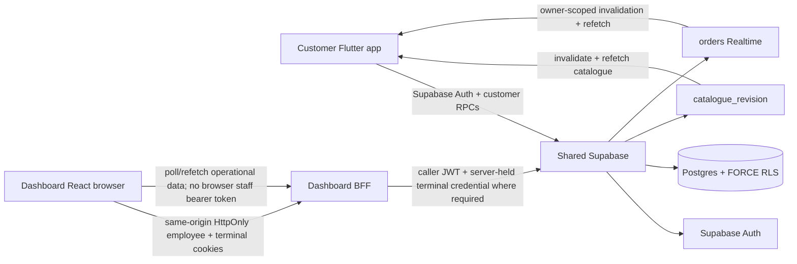

# AIDA Café Architecture

Updated: 2026-09-11

## System topology



## Repository/runtime ownership

- Customer/backend repository: `Hermann-33/Aida_System`, default branch `master`.
- Dashboard/Admin/POS repository: `Hermann-33/Aida_System-Dashboard`, default branch `main`.
- Shared backend: Supabase project `Aida System`, ref `eswovqxqzfevcdwwcmuh`.
- Canonical executable Supabase migrations live only in `Hermann-33/Aida_System/supabase/migrations/` unless a future accepted ADR changes ownership.
- Shared governance documents are mirrored across both repositories per ADR-0007.

## Accepted architecture decisions

Current architecture is governed by the accepted ADR set, including:

- ADR-0006 — dual repositories over one shared backend;
- ADR-0007 — mirrored project documentation;
- ADR-0008 — Dashboard same-origin BFF;
- ADR-0009 — shared catalogue and revision signal;
- ADR-0010 — authoritative ordering and scheduled fulfilment;
- ADR-0011 — branch authority and operational scope;
- ADR-0012 — sales-point and terminal authority.

## Identity and session authority

Supabase Auth owns authentication. Trusted role and disabled-state authority lives in `user_profiles`; customer membership identity/code lives in `members`.

Dashboard employee sessions remain behind the same-origin BFF:

- browser receives HttpOnly access/refresh cookies;
- BFF validates identity, role and disabled state;
- BFF forwards the caller JWT to Supabase;
- no service-role credential is used for normal employee flows;
- no employee bearer token is persisted or exposed to browser JavaScript.

Trusted employee operational scope comes from `employee_branch_assignments`. Ordinary staff with no assignment fail closed. Admin/Owner remain global operational roles for the current tranche.

Customer Flutter uses only public/publishable Supabase configuration plus customer-scoped RLS/RPC boundaries.

## Catalogue authority

Supabase Postgres is authoritative for catalogue data:

```text
catalogue_categories
catalogue_items
catalogue_item_variants
catalogue_item_addons
catalogue_option_groups
catalogue_option_values
catalogue_item_option_values
catalogue_revision
catalogue_audit_events
```

`catalogue_items.kind` separates products from reusable add-ons. `catalogue_items.is_drink` marks products that consume option groups.

Current standard drink groups are:

```text
Temperature: Hot | Iced
Sweetness: Regular | Less sweet | Least sweet
```

Required groups must retain at least one available value and exactly one available default. Compatible add-ons are normalized product-to-addon links.

Customer reads use `get_catalogue()`. Admin catalogue mutations use same-origin BFF/RPC calls with the employee caller JWT. `catalogue_revision` is invalidation only, never the catalogue itself.

## Authoritative quote/order boundary

Clients submit only selection and fulfilment intent:

```text
itemId
variantId?
optionValueIds[]
addOnIds[]
quantity
note?
fulfillmentType
requestedPickupAt?
clientRequestId
```

Clients are not authority for labels, commercial prices, totals, customer/member identity, order numbers, status, payment state or operational topology.

`quote_order(jsonb)` validates product availability, variants, required/default options and compatible add-ons, then calculates authoritative `pricingVersion=2` totals:

```text
base + variant + selected/default options + compatible add-ons
```

`place_customer_order` and terminal-bound `place_pos_order(jsonb,text)` persist server-owned snapshots. Placement remains idempotent through `clientRequestId`.

Commercial history is immutable through:

```text
orders
order_lines
order_line_addons
order_line_options
order_events
```

## Operational topology authority — Phase 1 complete

Phase 1 establishes this trusted chain:

```text
branches
  -> sales_points
      -> terminals
          -> terminal credential

employee_branch_assignments
  -> staff operational scope

terminal credential + employee branch scope
  -> trusted POS branch/sales-point/terminal attribution
```

Live seed topology:

```text
BR-MAIN — Main Café
  SP-MAIN — Main Counter
    POS-MAIN-01
```

The seeded terminal intentionally remains `pending` until manager enrolment.

Every order has immutable `branch_id`. New POS orders additionally persist immutable `sales_point_id` and `terminal_id` resolved server-side from the terminal credential. Customer orders remain terminal-free.

The browser never chooses trusted operational IDs for placement. A one-time manager-issued enrolment code activates a terminal; the Dashboard BFF stores the resulting credential in an HttpOnly cookie. Revocation invalidates terminal authority immediately.

Authenticated table SELECT on `sales_points` and `terminals` is constrained by FORCE-RLS Admin/Owner policies. Anonymous reads and direct client DML remain denied.

The credentialless `place_pos_order(jsonb)` signature is not executable by `authenticated`; the terminal-bound signature is the live POS contract.

## Dashboard live operational flow

```text
Admin/Owner
 -> same-origin BFF
 -> branch / sales-point / terminal management RPCs
 -> Supabase

Manager enrols workstation
 -> one-time enrolment code
 -> BFF enrol endpoint
 -> HttpOnly terminal credential cookie

Staff POS
 -> employee session + terminal credential
 -> BFF
 -> place_pos_order(payload, terminalCredential)
 -> Supabase validates employee branch scope + active terminal
 -> order snapshots trusted branch/sales-point/terminal IDs
```

Admin Locations, Terminals and Employees use trusted APIs in live mode. Explicit UI Preview remains fixture-backed and non-authoritative.

## Scheduling and fulfilment

Current global scheduling policy remains:

```text
Asia/Kuala_Lumpur
15-minute minimum lead
15-minute preparation lead
15-minute slot interval
7-day horizon
```

Scheduled orders snapshot immutable `prepareAt`. Backend snapshots derive `scheduleState = future | due | overdue | null`. Reaching `prepareAt` never auto-transitions fulfilment status; staff action remains authoritative.

Legal staff transitions remain versioned and server-validated.

Branch-specific hours, closures, capacity and explicit customer pickup-branch selection remain Phase 4.

## Realtime boundary

`supabase_realtime` publishes current invalidation signals for catalogue revision and authorized order headers.

Customer clients may use their Supabase session to receive authorized invalidation and refetch. Dashboard React does not expose its HttpOnly employee token for direct Realtime and instead polls/refetches same-origin BFF endpoints.

## Validation boundary

Phase 1 closeout evidence is recorded in:

`docs/context/PHASE_1_OPERATIONAL_TOPOLOGY_CLOSEOUT_2026-09-11.md`

Current executable evidence:

```text
Backend database audit #22      PASS
Customer release audit #114     PASS
Dashboard CI #23                PASS
```

The clean database audit replays the full canonical migration ledger and passes branch authority, operational topology, general order and scheduled-order regression suites.

## Still separate authority domains

Not yet authoritative:

- shifts/cash reconciliation;
- employee Auth-user provisioning, role mutation and badge/PIN lifecycle;
- branch opening hours/closures/capacity and explicit pickup branch;
- inventory/recipes/depletion;
- loyalty/rewards/vouchers;
- promotions/discounts;
- tax/accounting/reporting;
- real payment capture/refunds/processor settlement;
- printer/KDS/payment-device integrations;
- delivery;
- hosted production/release operations.
