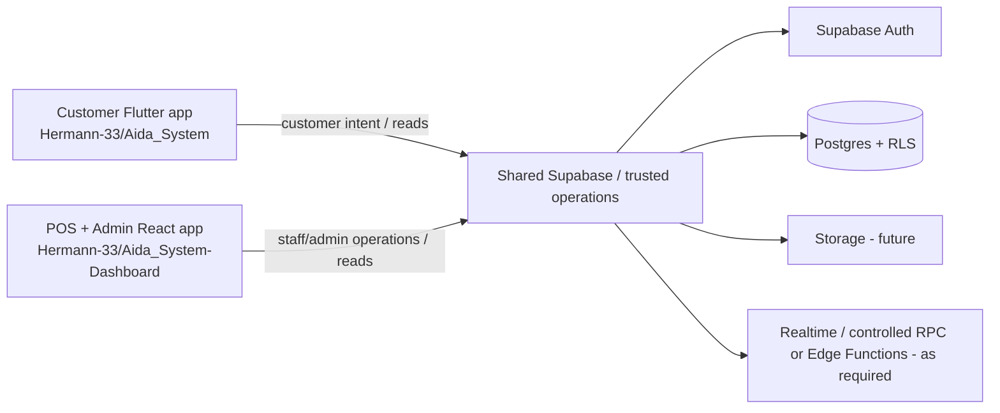

# AIDA Café Architecture

Updated: 2026-08-12

## System architecture

The clients are separate deployables but one product. No client is authoritative for money, identity, authorization or operational state.

## Customer runtime

- Flutter/Dart, Material 3, Riverpod.
- Android, iOS and web source.
- `AuthGate`, five-tab `IndexedStack`, imperative `Navigator` detail routes.
- `MemberRepository` abstraction bound only to `MockMemberRepository` today.
- Client/session simulation for authentication, profile edits, favourites, cart, checkout/order tracking and history.

## Dashboard runtime

- React 19, TypeScript 6, Vite 8, Tailwind CSS 4.
- React Router with employee, POS and admin layouts.
- React component/module state, preview fixtures and session storage.
- TanStack Query provider exists but live queries/mutations are not yet the data layer.
- Preview/non-preview auth and terminal adapters anticipate same-origin HTTP APIs and HttpOnly credentials; production API behavior is not yet implemented against the shared Supabase system.

## Shared backend foundation

Supabase Auth is the intended identity source. Current Postgres foundation:

- `public.user_profiles`: trusted profile/application role record.
- `public.members`: server-owned membership identity and stable member code.
- `public.student_verifications`: declaration and trusted review workflow.
- private role helpers for RLS.
- auth trigger provisions profile/member rows.

All exposed foundation tables have forced RLS.

## Canonical database ownership

Until superseded by ADR, version-controlled migrations live in `Hermann-33/Aida_System/supabase/`. The dashboard repository consumes the resulting shared contract but does not maintain a duplicate migration chain.

Database tasks may require coordinated client-contract analysis in both repos even when SQL changes are committed only to the migration-owning repo.

## Authoritative ownership

| Domain | Authority |
|---|---|
| Auth identity/session | Supabase Auth / trusted session boundary |
| Customer profile/app role | `user_profiles` foundation; future controlled role operations |
| Member code / verification | `members` + `student_verifications` |
| Branches, terminals, employees | Future shared backend |
| Catalogue/prices/modifiers | Future shared backend |
| Quote/totals/discounts | Future controlled server operation |
| Orders/status/receipt facts | Future shared persistence + controlled transitions |
| Payments/refunds | Approved provider/device + trusted server record |
| Loyalty/rewards/vouchers | Future auditable ledger and atomic operations |
| Inventory | Future stock ledger/operations |
| Marketing/reporting/audit | Future trusted publication/aggregate/audit boundaries |

## Cross-client contract rule

Stable IDs and lifecycle enums are backend contracts, not UI implementation details. Customer and dashboard adapters must map to the same contract and be updated together when a breaking contract changes.

Examples: member code, branch/sales-point ID, menu item/variant/modifier ID, quote/order ID, order status, payment status/reference, reward/voucher ID and status, employee role, terminal ID and inventory location.

## Security architecture

- Customer and dashboard browsers/apps are untrusted.
- Staff/admin UI guards are usability controls only; RLS/server authorization remains mandatory.
- Branch scoping and global-manager privileges must be verified server-side.
- Terminal enrolment/credentials and manager approval require trusted credential lifecycle and audit.
- Service-role keys never enter Flutter or browser bundles.
- Privileged business operations should use controlled RPC/Edge Function/server boundaries when direct table mutation cannot safely express authorization, atomicity or idempotency.

## Deferred architecture

Catalogue/storage, branch/terminal/employee schema, quote/order/payment model, loyalty ledger, inventory, marketing, reporting, realtime subscriptions, notification delivery, production offline sync, observability, backups and deployment runbooks remain future bounded decisions/tasks.