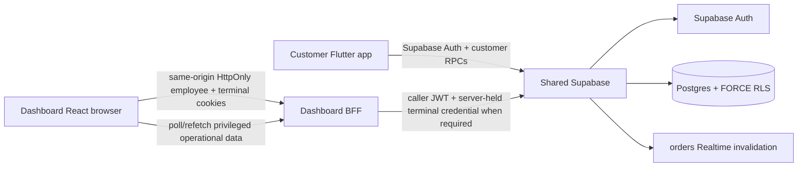

# AIDA Café Architecture

Updated: 2026-09-12

## System topology



## Ownership

- Customer/backend repository: `Hermann-33/Aida_System`, default `master`.
- Dashboard/Admin/POS repository: `Hermann-33/Aida_System-Dashboard`, default `main`.
- Shared backend: Supabase project `Aida System`, ref `eswovqxqzfevcdwwcmuh`.
- Canonical executable Supabase migrations live only in `Hermann-33/Aida_System/supabase/migrations/`.
- Mirrored project governance docs must remain synchronized across both repositories.

## Identity and session authority

Supabase Auth owns authentication. `user_profiles` owns trusted application role/disabled state; `members` owns customer membership identity.

Dashboard privileged flows remain behind the same-origin BFF:

- employee access/refresh state is held in HttpOnly cookies;
- terminal credential is held in an HttpOnly cookie and never returned to browser JavaScript;
- the BFF forwards the caller JWT to Supabase;
- no service-role secret is used for ordinary staff/Admin operations;
- no reusable employee bearer token is stored in browser-readable state.

Customer Flutter uses only publishable/public Supabase configuration and customer-scoped authorization boundaries.

## Catalogue and order authority

Supabase is authoritative for catalogue availability, modifiers, prices and order totals. Clients submit selection/fulfilment intent only.

Commercial order history is persisted through immutable snapshots in:

```text
orders
order_lines
order_line_addons
order_line_options
order_events
```

`clientRequestId` provides placement idempotency. Customer orders remain scoped to the authenticated customer/member relationship. Staff fulfilment transitions are branch-scoped and optimistic-versioned.

## Phase 1 operational topology — COMPLETE

Trusted chain:

```text
branches
 -> sales_points
 -> terminals
 -> terminal credential

employee_branch_assignments
 -> staff operational scope

terminal credential + employee branch scope
 -> immutable POS branch/sales-point/terminal attribution
```

The browser does not choose trusted operational IDs for placement. Manager-issued one-time enrolment activates a terminal; revocation invalidates authority immediately.

## Phase 2 shift and cash authority — COMPLETE

Phase 2 extends the chain:

```text
branch
 -> sales point
 -> terminal
 -> employee
 -> shift
 -> POS order / cash ledger
```

Trusted resources:

```text
public.shifts
public.cash_movements
public.orders.shift_id
public.orders.tender_type
public.orders.payment_state
public.orders.paid_at
```

Shift contracts:

- lifecycle: `open | locked | closed`;
- one live open/locked shift per terminal;
- one live open/locked shift per operator;
- terminal/branch/sales-point attribution comes from the enrolled terminal authority;
- operator identity comes from `auth.uid()` and trusted role/scope state;
- opening float is integer sen;
- state changes use optimistic `status_version`;
- closed reconciliation facts are persisted server-side.

Cash contracts:

- ledger is append-only;
- movement types: `cash_in | cash_out`;
- amount is integer sen;
- actor/reason/timestamp are trusted persisted facts;
- expected cash is derived from opening float + movements + trusted cash-paid POS sales;
- employee submits actual count only;
- backend derives variance;
- non-zero variance close requires Admin/Owner authority.

POS contracts after Phase 2:

- new POS placement requires a valid `open` shift;
- shift, terminal, sales point, branch and operator must match server-side;
- persisted `shift_id`, tender and payment state are protected from ordinary mutation;
- Phase 2 tender classification is deliberately limited to `cash | unpaid`;
- `cash` persists paid state and server `paid_at`;
- customer orders remain shift-free/unpaid;
- cash-paid cancellation is blocked until trusted refund authority exists.

## Dashboard Phase 2 flow

```text
Employee session + terminal HttpOnly credential
 -> same-origin BFF
 -> caller JWT + terminal credential
 -> shift RPC
 -> Supabase validates role/scope/topology/operator
 -> trusted shift snapshot
```

Live endpoints:

```text
GET  /api/v1/shifts/current
POST /api/v1/shifts/open
POST /api/v1/shifts/lock
POST /api/v1/shifts/resume
POST /api/v1/shifts/cash-movement
GET  /api/v1/shifts/reconciliation
POST /api/v1/shifts/close
GET  /api/v1/admin/shifts
```

Live POS blocks sale placement when there is no open trusted shift. Expected cash is never browser authority. UI Preview remains fixture-backed and explicitly non-authoritative.

## Scheduling and Realtime boundaries

Scheduled-order preparation remains server-owned and versioned. Branch-specific hours, closures, capacity and explicit customer pickup branch remain Phase 4.

Customer Realtime is used as authorized invalidation followed by refetch. Dashboard does not expose its employee JWT for direct Realtime; privileged data continues through the same-origin BFF.

## Security invariants

- no authorization decision trusts customer-editable `user_metadata`;
- public/exposed data access remains under explicit grants plus RLS where applicable;
- privileged functions validate `auth.uid()`, trusted role and operational scope;
- private helper functions are not general browser APIs;
- customer QR/member possession is not authentication;
- preview fixtures never become backend authority;
- service-role/secret credentials remain absent from customer and Dashboard browser code.

## Validation boundary

Phase 2 detailed evidence:

`docs/context/PHASE_2_SHIFT_CASH_CLOSEOUT_2026-09-12.md`

Final pre-refresh validation evidence:

```text
Backend database audit #46   COMPLETE
Customer release audit #138 COMPLETE
Dashboard CI #59             COMPLETE
```

## Deferred authority domains

- Phase 3 customer account deletion/privacy/consent;
- branch hours/closures/capacity and explicit pickup branch;
- inventory/recipes/stock depletion;
- loyalty/rewards/vouchers;
- promotions/discounts;
- reporting/tax/accounting;
- external processor settlement and refunds;
- employee credential lifecycle;
- printer/KDS/payment-device integrations;
- delivery and deployment-heavy operations.

After Phase 3 becomes `COMPLETE`, implementation stops for the combined Phase 1–3 Astra audit. Phase 4 does not begin before that boundary is resolved or explicitly accepted.
