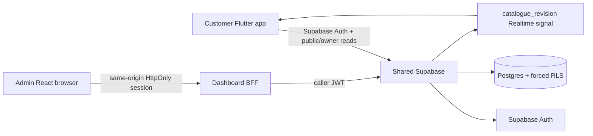

# AIDA Café Architecture

Updated: 2026-08-12

## Shared catalogue

ADR-0009 makes Supabase Postgres the catalogue authority. `catalogue_categories`, `catalogue_items`, `catalogue_item_variants` and `catalogue_item_addons` store publication, price, availability and customization data. Money is integer sen.

Customer reads use `get_catalogue()` under RLS. Admin mutations use `save_catalogue_category(jsonb)` and `save_catalogue_item(jsonb)` as `SECURITY INVOKER` RPCs through the dashboard BFF. No service-role credential enters a client.

`catalogue_revision` is the only catalogue table published to Supabase Realtime. It invalidates the customer snapshot; clients then re-read authoritative data under RLS.

## Other authority

Identity/roles remain Supabase Auth + trusted `user_profiles`. Member identity/code remains `members`. Orders, payments, loyalty, inventory, branch/terminal/staff operational state and reporting require their own trusted backend tasks.
