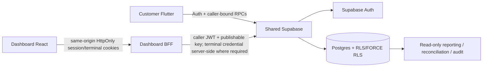

# AIDA Café Architecture

Updated: 2026-09-16

## System topology



AIDA spans `Hermann-33/Aida_System`, `Hermann-33/Aida_System-Dashboard`, and Supabase project `eswovqxqzfevcdwwcmuh`. Canonical executable migrations live only in `Aida_System/supabase/migrations/`.

## Trusted authority through Phase 8

Supabase/server owns authenticated identity, trusted role/disabled state, membership, employee branch scope, operational topology, terminal credential validity, shift/cash state, current tender/payment classification, catalogue/pricing, branch scheduling/capacity, inventory/recipes/depletion, privacy/account deletion, loyalty/reward/voucher state, promotion configuration/evaluation, persisted commercial snapshots and the source facts used by Phase 8 reporting.

Dashboard privileged operations stay behind the same-origin BFF. Employee access/refresh and terminal credentials are HttpOnly. The BFF forwards the caller JWT and publishable key. No normal flow uses a service-role credential or exposes reusable employee/terminal secrets to browser JavaScript. Preview fixtures never become backend authority.

## Authority chain

```text
Phase 1  topology / employee branch scope / POS attribution
Phase 2  shifts / cash ledger / POS tender classification
Phase 3  privacy / whole-account deletion / retained-history anonymisation
Phase 4  pickup calendar / capacity / quote-place revalidation
Phase 5  recipes / branch inventory / transactional depletion-reversal
Phase 6  loyalty / rewards / vouchers / one-time consumption
Phase 7  promotions / stacking / usage / immutable application snapshots
Phase 8  source-backed operational reporting / transactions / audit projections
Phase 9  next: payment/refund/external-integration authority
Phase 10 final App Store/release gate
```

## Phase 8 reporting architecture

Canonical migration `20260916100000_create_reporting_audit_authority.sql` adds no reporting table. It exposes:

```text
public.get_admin_reporting_summary(jsonb)
public.get_admin_transaction_report(jsonb)
public.get_admin_audit_events(jsonb)
```

Public report functions are authenticated-only `SECURITY INVOKER`. Guarded private implementations are caller-bound `SECURITY DEFINER` functions with empty `search_path` and Admin/Owner checks.

The summary derives accepted order value, counts/statuses, voucher/promotion discounts, paid POS cash, unpaid accepted value, branch/sales-point/product dimensions, shift/cash reconciliation, loyalty/application aggregates and inventory movements.

The transaction projection returns source-backed order/topology/commercial detail while explicitly stating that total value is not processor settlement and refund data is unavailable until Phase 9.

The audit projection combines durable order, cash, inventory, loyalty, voucher/promotion and shift lifecycle facts. Missing historical events that were never persisted are declared rather than fabricated.

## Dashboard reporting boundary

Production pages `/admin`, `/admin/reports/sales`, `/admin/reports/transactions` and `/admin/system/audit` consume strict Phase 8 response parsers through the same-origin employee-session BFF. Synthetic production trend/payment/refund/audit facts were removed. Preview mode remains fixture-only and blocking browser tests assert zero privileged reporting requests.

## Live deployment

Phase 8 canonical migration is live as `20260916013938_create_reporting_audit_authority`. Fresh post-DDL advisors show no Phase 8-created WARN/ERROR. The existing Supabase Auth leaked-password-protection warning remains separate.

## Privacy and retention

Whole-account deletion removes customer-owned identity/loyalty state and detaches identifying customer/member references from retained commercial history. Reporting exposes only bounded operational/commercial fields and does not surface customer PII merely because it exists in source tables.

## Phase 9 architectural boundary

Phase 9 must add server-authoritative provider-neutral payment/refund lifecycle state. It must distinguish intent, authorization, capture, settlement/reconciliation, failure/cancellation and refunds; external processor truth must come from authenticated server/provider evidence, not browser/Flutter claims. Cash/unpaid POS semantics remain valid. Provider credentials/secrets remain server-side.

## Audit governance

Owner-approved sequence is now Phase 8 -> Phase 9 -> Phase 10 under normal engineering gates, followed by one cumulative independent/Astra/Codex audit across Phases 1–10. The audit is deferred, not waived.

Phase PRs remain draft/unmerged unless explicitly authorized.
