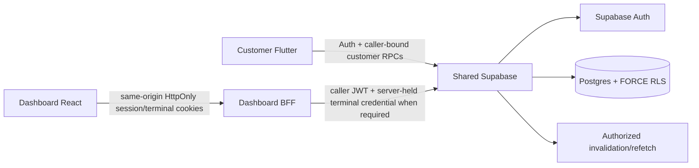

# AIDA Café Architecture

Updated: 2026-09-15

## System topology



AIDA is one product across `Hermann-33/Aida_System`, `Hermann-33/Aida_System-Dashboard`, and Supabase project `eswovqxqzfevcdwwcmuh`. Canonical executable migrations live only in `Aida_System/supabase/migrations/`.

## Trusted authority through Phase 6

Supabase/server owns authenticated identity, trusted role/disabled state, membership, employee branch scope, operational topology, terminal credential validity, shift/cash state, tender/payment classification, catalogue/pricing, branch scheduling/capacity, inventory/recipes/depletion, privacy/account deletion, loyalty balances/reward/voucher state, authoritative discounts and persisted commercial snapshots.

Dashboard privileged operations stay behind the same-origin BFF. Employee access/refresh and terminal credential are HttpOnly; the BFF forwards the caller JWT and publishable key. No normal flow uses a service-role credential or browser-readable reusable employee bearer/terminal secret. Preview fixtures are never backend authority.

## Authority chain

```text
Phase 1: branch -> sales point -> terminal -> employee branch scope -> POS attribution
Phase 2: employee + terminal -> shift -> POS order / append-only cash ledger
Phase 3: customer -> privacy preferences / whole-account deletion -> anonymized retained history
Phase 4: branch calendar/policy -> pickup slot capacity -> authoritative quote/place
Phase 5: recipe -> branch stock -> transactional depletion / cancellation reversal
Phase 6: member -> loyalty ledgers/balances -> reward/voucher -> discount / one-time consumption
```

## Phase 6 loyalty architecture

Trusted resources include `loyalty_program_config`, `member_loyalty_accounts`, `loyalty_order_awards`, point/stamp ledgers, `reward_catalogue`, `member_vouchers` and `voucher_order_applications`.

Completed orders award points/stamps exactly once using an order award anchor. Current balances are server-maintained derivatives of trusted mutations. Redemption checks caller-owned membership and deducts under row lock before issuing a server-owned voucher. Stamp milestones issue configured free-item vouchers and preserve rollover.

`quote_order` may apply one caller/member-bound voucher and derives the discount. Placement revalidates and consumes the voucher atomically with accepted order creation. Accepted `orders.discount_sen` and voucher application snapshots are immutable commercial facts.

POS loyalty lookup is additionally bound to employee identity, server-held terminal credential and an open shift. Admin/Owner mutation RPCs bind actor identity to the session and preserve adjustment reasons.

## Phase 1–3 remediation architecture

Later commercial hardening preserves a narrow internal customer-anonymization transition. Whole-account deletion scrubs retained free text, replaces the original request digest, deletes customer-owned loyalty state and detaches identifying references from retained order/loyalty commercial snapshots. The generic low-level order writer is owner-internal; matching POS retries can resolve after shift lock/close under current terminal/caller authority, but new POS orders still require an open shift.

## Realtime and payment boundaries

Customer Realtime is authorized invalidation followed by refetch. Dashboard privileged data does not expose employee tokens for direct Realtime.

Cash/unpaid remains internal POS tender authority. External payment capture/refunds/processor settlement remain deferred.

## Security invariants

- authorization never trusts customer-editable Auth metadata or preview state;
- no service-role/secret credential is shipped to Flutter/browser code;
- employee JWT and terminal credential remain HttpOnly for Dashboard live flows;
- branch/terminal/shift/scheduling/inventory/loyalty/commercial authority is server-derived;
- direct client mutation of protected operational/loyalty tables is denied;
- stock depletion is transactional and non-negative;
- voucher discount/consumption is revalidated atomically at placement;
- customer self-deletion cannot target another user and does not erase staff/POS audit identity;
- retained customer history loses customer/member/Auth and loyalty-owned identifiers plus customer-authored free text/request digest.

## Next architecture boundary

Phase 7 may add generalized promotions/discounts and stacking/targeting rules. It must compose with the existing immutable `discount_sen`/voucher commercial authority rather than moving discount authority to clients. Phase 7 is not started by this closeout.