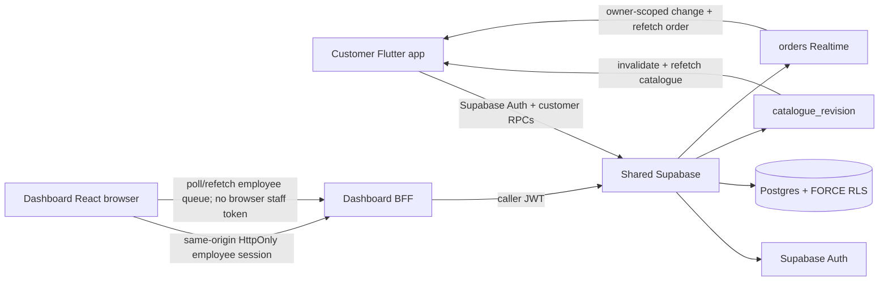
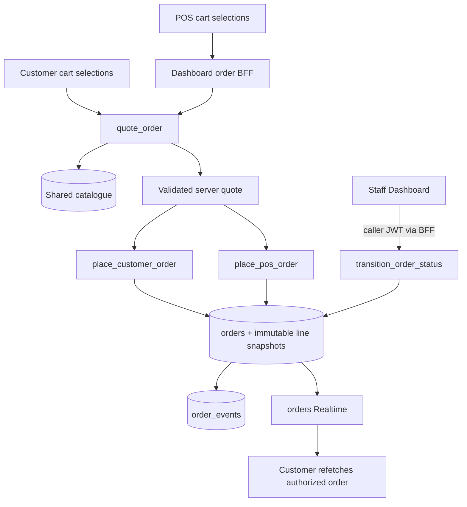

# AIDA Café Architecture

Updated: 2026-08-17

## Repository/runtime topology

- Customer: `Hermann-33/Aida_System`, Flutter/Dart/Riverpod, default branch `master`.
- Dashboard/Admin/POS: `Hermann-33/Aida_System-Dashboard`, React/TypeScript/Vite, default branch `main`.
- Shared backend: Supabase project `Aida System`, ref `eswovqxqzfevcdwwcmuh`.
- Canonical executable Supabase migrations live only in the customer repository `supabase/` workspace unless a future accepted ADR changes ownership.

## Shared identity/member authority

Supabase Auth owns authentication. Trusted employee/admin authorization lives in `user_profiles.app_role` plus `disabled_at`; customer membership identity/code lives in `members`. Client metadata, route guards and browser storage do not grant trusted role/member authority.

The Dashboard keeps privileged employee credentials behind the ADR-0008 same-origin BFF. The browser receives HttpOnly cookies, while the BFF validates the employee and forwards that caller JWT to Supabase. No service-role credential or browser-readable employee bearer token is part of the architecture.

Customer Flutter uses the public/publishable Supabase client configuration and customer-scoped RLS/RPC authority. Public signup cannot self-promote to employee roles or assign trusted member codes/verification state.

## Shared catalogue

ADR-0009 makes Supabase Postgres the catalogue authority. `catalogue_categories`, `catalogue_items`, `catalogue_item_variants` and `catalogue_item_addons` store publication, price, availability and customization data. Money is integer sen.

Customer reads use `get_catalogue()` under RLS. Dashboard Admin mutations use `save_catalogue_category(jsonb)` and `save_catalogue_item(jsonb)` through the BFF with the caller JWT.

`catalogue_revision` is an invalidation signal. Customer clients re-read authoritative data after a revision change. The production customer menu and Dashboard POS catalogue browser have no runtime hardcoded catalogue fallback.

## Authoritative order and scheduling boundary

ADR-0010 makes the same Supabase project authoritative for customer and POS order pricing, persistence, scheduling and fulfilment status.

Clients submit IDs, quantities, notes and fulfilment intent only. They are not authority for product names, prices, totals, customer/member identity, order numbers, status or payment state. `quote_order(jsonb)` revalidates the current published/available catalogue, variants and compatible add-ons before deriving integer-sen totals.

`orders`, `order_lines` and `order_line_addons` persist server-owned commercial snapshots. Placement is idempotent through `clientRequestId`. Staff-only fulfilment transitions use an expected `statusVersion` and append `order_events` evidence.

The current schedule policy is `Asia/Kuala_Lumpur`, 15-minute minimum lead, 15-minute slots and seven-day horizon. Branch hours, closures, capacity and branch-scoped queues remain deferred.

## Dashboard order integration

TASK-CLOSEOUT-001 completed the React order path over the existing BFF:

- typed same-origin policy/quote/place/queue/detail/status adapter;
- POS cart mapped to catalogue IDs, quantity, optional note and fulfilment intent only;
- server quote rendered as commercial authority;
- stable `clientRequestId` reused for the same placement retry;
- ASAP/scheduled choices derived from server policy;
- cart cleared only after persisted placement;
- explicit `Pay at counter`/unpaid semantics;
- live order queue polled every ~2.5 seconds with no preview-order fallback;
- legal versioned transitions with conflict refetch.
- server-projected scheduled operations (`prepareAt`, `serverNow`, `scheduleState`) split into Active/Scheduled/Ready/History without adding statuses or browser-driven transitions;
- live staff Sale/Orders entry in accepted single-café/global scope, independent of deferred terminal/shift authority.

## Realtime boundary

`supabase_realtime` publishes:

- `catalogue_revision` — catalogue invalidation;
- `orders` — authorized order-header changes.

Immutable order lines/add-ons are not separately published. Customer clients subscribe with their Supabase session and refetch the authorized order after a header change.

The Dashboard employee token remains HttpOnly, so React does not expose it to open a direct Supabase Realtime connection. The Dashboard polls/refetches the same-origin order BFF and invalidates after local place/status mutations.

## Android release boundary

The customer production manifest declares `android.permission.INTERNET` because Auth, member/profile, catalogue, orders and Realtime require TLS network access. The committed Android build uses AGP 8.9.1 with Gradle 8.11.1 and Flutter compatibility properties; release packaging was reproduced in an independent clean worktree. Flutter contains only public project configuration, never a service-role/secret credential.

## Validated end-to-end boundary

TASK-CLOSEOUT-001 final live E2E proved the supported chain:

customer Auth/member
→ authoritative quote
→ `place_customer_order`
→ persisted order
→ Dashboard BFF queue
→ `confirmed` v1 → `preparing` v2 → `ready` v3 → `completed` v4
→ customer-authorized `get_order` refresh after each transition.

The retained evidence is order `100006` (`7cf027dc-3ff0-4604-a3fd-c7a943aac603`), authoritative total 1,290 sen.

## Explicitly separate authority

Real payment settlement/refunds, loyalty earning/redemption, inventory depletion, discounts/promotions, tax/accounting, revenue reporting, branch scheduling/capacity, delivery and hosted production deployment remain separate trusted domains. They must consume authoritative order/payment state rather than frontend-computed values.
