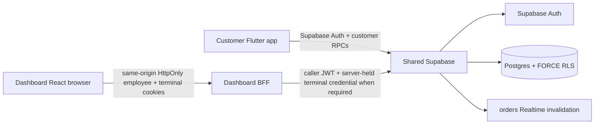

# AIDA Café Architecture

Updated: 2026-09-12

## System topology



AIDA is one product across `Hermann-33/Aida_System`, `Hermann-33/Aida_System-Dashboard`, and Supabase project `eswovqxqzfevcdwwcmuh`. Canonical executable migrations live only in `Hermann-33/Aida_System/supabase/migrations/`.

## Trusted authority through Phase 3

Supabase/server owns authenticated identity, trusted application role/disabled state, membership identity, employee branch scope, branch/sales-point/terminal topology, terminal credential validity, shift state, cash reconciliation, tender/payment classification, catalogue/commercial pricing, persisted order state, customer privacy preferences, and whole-account deletion/anonymization.

Dashboard privileged operations stay behind the same-origin BFF. Employee access/refresh and terminal credentials are HttpOnly; the BFF forwards the caller JWT; no service-role secret or browser-readable employee bearer token is used. Preview fixtures are never backend authority.

Customer Flutter uses publishable Supabase configuration and customer-scoped RPC/RLS boundaries. Customer-editable Auth metadata is never authorization authority.

## Phase 1 — operational topology

Trusted chain:

```text
branch
 -> sales point
 -> terminal
 -> employee branch scope
 -> POS order attribution
```

The browser does not choose trusted operational IDs for live placement. Manager-issued one-time enrolment activates a terminal; the credential is server-held by the Dashboard BFF; revocation or branch-scope removal invalidates authority. Accepted POS topology attribution is immutable.

## Phase 2 — shift and cash authority

Phase 2 extends the chain:

```text
branch
 -> sales point
 -> terminal
 -> employee
 -> shift
 -> POS order / cash ledger
```

`public.shifts` and append-only `public.cash_movements` own shift/cash facts. New POS placement requires a matching open shift. Opening float and movements use integer sen; expected cash and closing variance are server-derived; non-zero variance close requires Admin/Owner authority. Persisted shift/tender/payment attribution is protected from ordinary mutation. Phase 2 tender semantics remain `cash | unpaid`; external processor settlement/refunds remain deferred.

## Phase 3 — customer privacy and account requirements

Phase 3 adds an explicit privacy lifecycle without deleting trusted commercial history or inventing a fake deleted-customer Auth identity.

Trusted resources/contracts:

```text
public.customer_privacy_preferences
public.orders.customer_deleted_at
public.delete_own_account()
public.get_my_privacy_preferences()
public.save_my_privacy_preferences(...)
```

Active customer order shape:

```text
customer_user_id != null
member_id != null
created_by_user_id != null
customer_deleted_at == null
```

Retained anonymized customer order shape after deletion:

```text
customer_user_id == null
member_id == null
created_by_user_id == null
customer_deleted_at != null
```

The deletion boundary is caller-bound to `auth.uid()` and accepts no target user ID. Public wrappers remain `SECURITY INVOKER`; privileged mutations live in private `SECURITY DEFINER` helpers that verify the supplied actor equals `auth.uid()` and is a trusted customer profile. Staff/Admin identities cannot use customer self-deletion.

Whole-account deletion:

1. selects only the caller's customer orders;
2. removes customer-authored retained free text (`order_lines.note`, `order_events.reason`);
3. performs one narrowly scoped internal transition that nulls customer/member/Auth order identity and sets `customer_deleted_at`;
4. verifies no caller identity/free text remains in retained order rows;
5. deletes the caller from `auth.users`, allowing profile/member/student/preference/session identity state to disappear through the established ownership/cascade boundary.

The deletion right does not depend on an active member row and remains available to a trusted customer profile even when the application profile is disabled. This avoids trapping a customer account behind unrelated membership/feature state.

Historical order number, line/product snapshots, quantities, prices, totals, currency, fulfilment/status timestamps, branch/sales-point/terminal/shift attribution and tender/payment facts remain as anonymized transaction/audit records. POS/staff actor identity is not weakened by customer deletion.

`customer_privacy_preferences` is FORCE-RLS protected and has no direct authenticated table grants. Customer RPCs expose owner-bound preference state; marketing defaults `false`, transactional notifications default `true`. Phase 3 adds preference state only—no push provider or OS notification permission.

Already-issued JWTs can remain cryptographically valid until expiry, so personalized customer RPCs continue requiring trusted profile/member state. Once deletion removes that state and nulls order ownership, a stale token cannot regain personalized history/order/privacy authority.

## Customer app Phase 3 flow

Settings exposes production account deletion, privacy preferences, Privacy Policy, Terms and Support. The server operation must succeed before local deletion success is reported. After success the app signs out best-effort, clears customer identity providers and removes the active offline membership cache.

Public/guest-capable surfaces include catalogue and legal/support information. Membership identity/QR, profile changes, customer order placement/history, student verification, account preferences and account deletion remain authenticated-only. No anonymous Supabase user is auto-created merely to represent a guest.

## iOS data/permission boundary

Phase 3 adds no camera, photo-library, location, contacts, microphone, Bluetooth, calendar/reminder, ATT/tracking or notification authorization request. It adds no tracking/advertising SDK. `qr_flutter` renders a QR and requires no camera permission. No StoreKit/IAP requirement is introduced because AIDA sells physical café goods.

Detailed evidence: `docs/context/PHASE_3_IOS_DATA_PERMISSION_AUDIT.md`.

## Scheduling, Realtime and payment boundaries

Scheduled preparation remains server-owned and versioned. Branch-specific hours/closures/capacity and explicit customer pickup branch remain later work.

Customer Realtime is authorized invalidation followed by refetch. Dashboard privileged data does not expose employee access tokens for direct Realtime.

External payment capture/refunds/processor settlement remain deferred. Phase 2 cash/unpaid state is internal POS authority, not a processor integration.

## Security invariants

- no authorization trusts customer-editable `user_metadata`;
- no service-role/secret credential is shipped to Flutter or browser code;
- no browser-readable employee bearer token or terminal credential;
- public RPC wrappers do not accept a target customer ID for deletion;
- retained customer transaction history loses stable customer/member/Auth identity;
- retained customer-authored free text is scrubbed on deletion;
- staff/POS actor retention is preserved;
- preview fixtures never become backend authority.

## Deferred authority domains

- branch hours/closures/capacity and explicit pickup branch;
- inventory/recipes/depletion;
- loyalty/rewards/vouchers;
- promotions/discounts;
- reporting/tax/accounting export;
- external processor settlement and refunds;
- employee Auth-user/credential lifecycle;
- printer/KDS/payment-device integrations;
- marketing campaign delivery provider;
- delivery and deployment-heavy operations.

After Phase 3 completion, implementation stops for the combined Phase 1–3 Astra audit boundary. Phase 4 must not begin before that boundary is resolved or explicitly accepted.