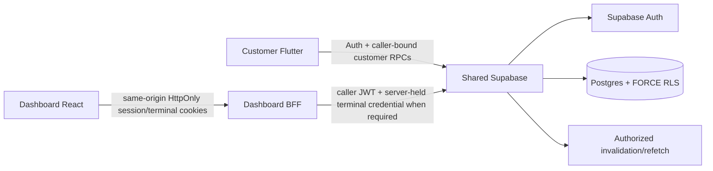

# AIDA Café Architecture

Updated: 2026-09-15

## System topology



AIDA is one product across `Hermann-33/Aida_System`, `Hermann-33/Aida_System-Dashboard`, and Supabase project `eswovqxqzfevcdwwcmuh`. Canonical executable migrations live only in `Aida_System/supabase/migrations/`.

## Trusted authority through Phase 7 code

Supabase/server owns authenticated identity, trusted role/disabled state, membership, employee branch scope, operational topology, terminal credential validity, shift/cash state, tender/payment classification, catalogue/pricing, branch scheduling/capacity, inventory/recipes/depletion, privacy/account deletion, loyalty balances/reward/voucher state, generalized promotion configuration/evaluation and persisted commercial snapshots.

Dashboard privileged operations stay behind the same-origin BFF. Employee access/refresh and terminal credentials are HttpOnly; the BFF forwards the caller JWT and publishable key. No normal flow uses a service-role credential or browser-readable reusable employee bearer/terminal secret. Preview fixtures are never backend authority.

## Authority chain

```text
Phase 1: branch -> sales point -> terminal -> employee branch scope -> POS attribution
Phase 2: employee + terminal -> shift -> POS order / append-only cash ledger
Phase 3: customer -> privacy preferences / whole-account deletion -> anonymized retained history
Phase 4: branch calendar/policy -> pickup slot capacity -> authoritative quote/place
Phase 5: recipe -> branch stock -> transactional depletion / cancellation reversal
Phase 6: member -> loyalty ledgers/balances -> reward/voucher -> voucher discount / one-time consumption
Phase 7: promotion config -> eligibility/stacking/usage -> quote/place -> immutable promotion application snapshot
```

## Phase 7 promotion architecture

Trusted resources include `promotions`, `promotion_branches`, `promotion_items`, `promotion_variants`, `promotion_addons` and `promotion_order_applications`.

Promotion configuration supports fixed or percentage discounts, optional maximum discount, active windows, minimum subtotal, priority, exclusive/stackable behavior, explicit voucher coexistence, member requirements and global/per-member usage limits. Catalogue scope is validated so product scope references products and add-on scope references add-ons.

`quote_order` computes the base Phase 5 quote, optional Phase 6 voucher adjustment and then automatically evaluates eligible active promotions. Clients do not submit accepted promotion IDs or discount values. The quote returns distinct `voucherDiscountSen`, `promotionDiscountSen`, total `discountSen`, `totalSen`, voucher snapshot and promotion snapshots.

Placement locks candidate promotion rows in deterministic order before re-evaluating the authoritative quote. This stabilizes global/member usage counts and prevents concurrent orders from oversubscribing a final promotion use. Accepted promotions are inserted into `promotion_order_applications` as immutable code/name/type/value/discount/priority/stacking/voucher-coexistence snapshots and must reconcile to the order's authoritative discount.

Phase 7 replaces the old Phase 6 pending-voucher trigger path with explicit finalization of voucher and promotion applications after order creation. Voucher and promotion discounts remain separate components even though `orders.discount_sen` stores the accepted total discount.

## Client architecture

Customer Flutter parses Phase 7 quote/order promotion snapshots fail-closed and verifies voucher/promotion components reconcile to total discount and order arithmetic.

Dashboard/POS uses the same authoritative fields. `/admin/rewards/campaigns` manages live promotion configuration through a same-origin BFF using the employee HttpOnly session and caller JWT. Preview mode renders fixtures and does not issue privileged promotion requests.

## Privacy and commercial retention

Whole-account deletion removes customer-owned loyalty state and detaches identifying customer/member references from retained order/application history while preserving legitimate non-identifying commercial facts. Promotion application snapshots are commercial history; nullable member/promotion foreign keys allow identity/configuration removal without rewriting accepted price facts.

## Realtime and payment boundaries

Customer Realtime is authorized invalidation followed by refetch. Dashboard privileged data does not expose employee tokens for direct Realtime.

Cash/unpaid remains internal POS tender authority. External payment capture/refunds/processor settlement remain Phase 9.

## Security invariants

- authorization never trusts customer-editable Auth metadata or preview state;
- no service-role/secret credential is shipped to Flutter/browser code;
- employee JWT and terminal credential remain HttpOnly for Dashboard live flows;
- branch/terminal/shift/scheduling/inventory/loyalty/promotion/commercial authority is server-derived;
- direct client mutation of protected operational/loyalty/promotion tables is denied;
- stock depletion is transactional and non-negative;
- voucher ownership/status/expiry/discount and promotion eligibility/usage are revalidated at placement;
- promotion usage-limit contention serializes rather than oversubscribing;
- customer self-deletion cannot target another user and does not erase staff/POS audit identity;
- retained customer history loses identifying customer/member/Auth references and customer-authored free text/request digest.

## Current deployment boundary

The Phase 7 repository implementation and CI are complete, but the currently connected Supabase account does not expose project `eswovqxqzfevcdwwcmuh`. Phase 7 therefore remains `PARTIAL` until its canonical migrations are deployed/reconciled on the real AIDA project and fresh security/performance advisors pass.

Phase 8–10 remain frozen.
