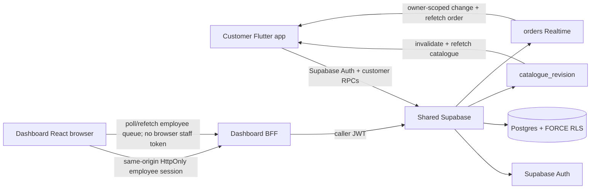

# AIDA Café Architecture

Updated: 2026-08-14

## Shared identity/member authority

Supabase Auth owns authentication. Trusted employee/admin authorization lives in `user_profiles.app_role` plus `disabled_at`; customer membership identity/code lives in `members`. Client metadata, route guards and browser storage do not grant trusted role/member authority.

The dashboard keeps privileged employee credentials behind the ADR-0008 same-origin BFF. The browser receives HttpOnly cookies, while the BFF validates the employee and forwards that caller JWT to Supabase. No service-role credential or browser-readable employee bearer token is part of the architecture.

## Shared catalogue

ADR-0009 makes Supabase Postgres the catalogue authority. `catalogue_categories`, `catalogue_items`, `catalogue_item_variants` and `catalogue_item_addons` store publication, price, availability and customization data. Money is integer sen.

Customer reads use `get_catalogue()` under RLS. Admin mutations use `save_catalogue_category(jsonb)` and `save_catalogue_item(jsonb)` through the dashboard BFF with the administrator caller JWT.

`catalogue_revision` is the catalogue invalidation signal. Customer clients re-read authoritative data after a revision change.

## Authoritative order and scheduling boundary

ADR-0010 makes the same Supabase project authoritative for customer and POS order pricing, persistence, scheduling and fulfilment status.

Clients submit IDs, quantities, notes and fulfilment intent only. They are not authority for product names, prices, totals, customer/member identity, order numbers, status or payment state. `quote_order(jsonb)` revalidates the current published/available catalogue, item variants and compatible add-ons before deriving integer-sen totals.

`orders`, `order_lines` and `order_line_addons` persist server-owned commercial snapshots. Placement is idempotent through `clientRequestId`. Staff-only fulfilment transitions use an expected `statusVersion` to prevent silent concurrent overwrites and append `order_events` evidence.

The current scheduled-pickup policy is a single-café policy: `Asia/Kuala_Lumpur`, 15-minute minimum lead, 15-minute slots and seven-day horizon. Branch hours, closures, capacity and branch-scoped queues are not authoritative yet and remain deferred.

## Realtime boundary

`supabase_realtime` currently publishes:

- `catalogue_revision` — invalidation only;
- `orders` — owner/staff-authorized order-header changes.

Immutable order lines/add-ons are not separately published. Customer clients subscribe with their Supabase session and refetch the full authorized order after a header change.

The dashboard employee token remains HttpOnly, so React must not expose it merely to open a Supabase Realtime connection. The current secure demo integration should refetch/poll the same-origin order BFF for the employee queue and invalidate immediately after local status/place mutations. A future server-side event bridge can replace polling if required.

TASK-CLOSEOUT-001 implements that dashboard integration: a typed order client maps local cart selections to intent-only payloads, authoritative quote/place responses drive totals and receipts, scheduled choices come from server policy, and the staff queue polls at 2.5 seconds with versioned legal transitions and conflict refetch.

## Explicitly separate authority

Real payment settlement/refunds, loyalty earning/redemption, inventory depletion, discounts/promotions, tax/accounting, revenue reporting, branch scheduling/capacity and delivery remain separate trusted backend domains. They must consume authoritative orders/payment state rather than frontend-computed totals.
