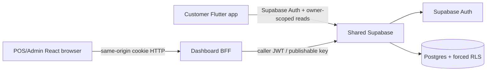

# AIDA Café Architecture

Updated: 2026-08-12

## System architecture

Both frontends are one product over one trusted Supabase backend. Browser/client state is never authority for identity, roles, member identity or other trusted business outcomes.

## Customer runtime

- Flutter/Dart/Riverpod.
- TASK-AUTH-001 wires Supabase Auth and owner-scoped profile/member reads.
- Signup intent includes only display name/student declaration; backend owns role, verification state and member code.
- Other domains remain mock/preview until their own backend tasks.

## Dashboard runtime

- React/TypeScript/Vite.
- Browser employee session client sends same-origin requests with `credentials: include`; it does not persist privileged bearer tokens.
- TASK-AUTH-002 adds `server/employeeBff.ts` plus `/api/v1/auth/employee/*` and `/api/v1/admin/members` adapters.
- BFF tokens live in HttpOnly cookies. The BFF revalidates Auth identity and trusted `user_profiles` state for every session/member capability.
- Admin browser login is independent from POS terminal enrolment.
- The same BFF core is mounted in Vite dev/preview; production/serverless adapters remain thin.

## Shared backend foundation

- `public.user_profiles`: trusted profile/application role and disabled state.
- `public.members`: server-owned membership identity/member code.
- `public.student_verifications`: declaration/review workflow.
- private role helpers, Auth provisioning trigger, forced RLS.
- `public.list_admin_members()`: authenticated, admin/owner checked, `SECURITY INVOKER` member-directory capability.

## Authority

| Domain | Authority |
|---|---|
| Customer identity/session | Supabase Auth + customer client session |
| Employee/admin identity | Supabase Auth + trusted `user_profiles` |
| Dashboard browser session transport | same-origin BFF + HttpOnly cookies |
| Member identity/code/status | Supabase `members` / verification records |
| Admin member directory | BFF with caller JWT -> `list_admin_members()` |
| Terminal identity | separate future terminal credential boundary |
| Catalogue/orders/payments/loyalty/inventory/reporting | future shared-backend tasks |

## Security invariants

- No Supabase service-role key, database secret, employee password/PIN or long-lived privileged bearer token enters a frontend bundle.
- Dashboard route guards are usability controls; BFF authorization and Supabase RLS/function checks are authoritative.
- Caller JWT, not service-role bypass, is used for admin member reads.
- State-changing cookie endpoints require same origin and authenticated data is not cached.
- Terminal credentials do not authenticate an administrator.

## Deployment

`vercel.json` and root `/api` adapters provide one supported same-origin serverless shape; hosting is not backend authority. A live AIDA deployment is still required before full-stack auth/member completion can be proven.
