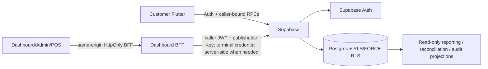

# AIDA System Map

Updated: 2026-09-16

**Current trusted runtime authority:** engineering `COMPLETE` through Phase 8.



## Authority chain

```text
Phase 1  branch -> sales point -> terminal -> employee branch scope -> POS attribution
Phase 2  employee + terminal -> shift -> POS order / append-only cash ledger
Phase 3  customer -> privacy preferences / whole-account deletion -> anonymised retained history
Phase 4  branch calendar/policy -> pickup slot capacity -> authoritative quote/place
Phase 5  recipe -> branch stock -> transactional depletion / cancellation reversal
Phase 6  member -> loyalty ledgers/balances -> reward/voucher -> discount / one-time consumption
Phase 7  promotion config/scope/usage -> quote/place revalidation -> immutable promotion snapshots
Phase 8  trusted Phase 1–7 facts -> read-only operational summary / transactions / audit projection
Phase 9  next: provider/payment evidence -> payment/refund state + reconciliation
Phase 10 final release/App Store gate
```

## Product surfaces

Customer Flutter uses Supabase repositories/RPCs for catalogue, membership/privacy, loyalty and orders. Server quote/place remains authoritative for scheduling/capacity, inventory, vouchers and promotions.

Dashboard/Admin/POS uses the same-origin BFF. Employee and terminal credentials remain HttpOnly/server-side. Production Phase 8 pages use strict reporting clients backed by caller-bound reporting RPCs; preview fixtures remain isolated and non-authoritative.

## Phase 8 data flow

```text
Admin/Owner Dashboard
 -> same-origin reporting BFF
 -> caller JWT
 -> SECURITY INVOKER report RPC
 -> guarded private implementation
 -> persisted Phase 1–7 source facts
 -> source-backed operational projection
```

Reports cannot mutate source state, widen actor scope or invent processor/refund/statutory-accounting facts.

## Security boundaries

- client metadata and preview state are not authorization authority;
- no normal Flutter/browser flow receives a service-role credential;
- reusable Dashboard employee/terminal credentials are not browser-readable;
- operational/commercial writes remain behind narrow server RPCs;
- reports are read projections only;
- accepted commercial facts stay immutable except documented anonymisation/compensating-event paths;
- customer deletion cannot target another account or erase staff/POS audit identity.

## Live backend

Project `eswovqxqzfevcdwwcmuh` is `ACTIVE_HEALTHY`. Phase 7 and Phase 8 canonical migrations are live. Fresh post-Phase-8 advisors report no Phase 8-created WARN/ERROR; the existing Supabase Auth leaked-password-protection warning remains separate.

## Next boundary

Phase 9 is authorized after final Phase 8 documentation-only exact-head CI. It must add trusted payment/refund lifecycle facts without allowing client-authored paid/refunded/settled state. The independent/Astra/Codex audit runs cumulatively after Phase 10, not between phases.
