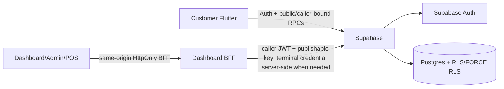

# AIDA System Map

Updated: 2026-09-15

**Current trusted runtime authority:** `COMPLETE` through Phase 7.



## Product surfaces

### Customer app

Production Flutter uses Supabase repositories for catalogue, membership/privacy, loyalty and orders. Public catalogue/legal/support surfaces can be accessed without creating an anonymous Auth identity. Authenticated customer capabilities include profile/privacy, loyalty/rewards/vouchers, checkout/order history and whole-account deletion.

Order quote/place is server-authoritative for branch scheduling/capacity, inventory, voucher application and automatic Phase 7 promotions. The app renders trusted promotion/voucher snapshots but does not submit accepted promotion IDs or discount amounts.

### Dashboard/Admin/POS

The browser uses same-origin BFF routes. Employee access/refresh and terminal credentials stay HttpOnly/server-side. Live surfaces include operational topology, employee branch scope, shifts/cash, catalogue, branch scheduling, inventory/recipes, loyalty/rewards/support, promotion configuration, POS member/voucher intent and authoritative quote/place/status flows.

Preview fixtures remain isolated and never become live authority.

## Authority chain

```text
Phase 1  branch -> sales point -> terminal -> employee branch scope -> POS attribution
Phase 2  employee + terminal -> shift -> POS order / append-only cash ledger
Phase 3  customer -> privacy preferences / whole-account deletion -> anonymised retained history
Phase 4  branch calendar/policy -> pickup slot capacity -> authoritative quote/place
Phase 5  recipe -> branch stock -> transactional depletion / cancellation reversal
Phase 6  member -> loyalty ledgers/balances -> reward/voucher -> discount / one-time consumption
Phase 7  promotion config/scope/usage -> quote/place revalidation -> immutable promotion snapshots
```

## Phase 7 data flow

```text
Admin/Owner Dashboard
 -> same-origin BFF
 -> caller-bound save_promotion / get_promotion_admin_state
 -> promotions + scope tables

Customer/POS order intent
 -> quote_order
 -> trusted catalogue + schedule + inventory + voucher validation
 -> server promotion evaluation
 -> voucherDiscountSen + promotionDiscountSen + total

place order
 -> deterministic candidate promotion row locks
 -> re-evaluate schedule/inventory/voucher/promotions
 -> accepted order
 -> immutable voucher/promotion application snapshots
```

Promotion exhaustion is commercial eligibility, not order failure: when the last use is consumed concurrently, the losing order proceeds at its newly authoritative undiscounted/remaining-offer price if all other order rules pass.

## Security boundaries

- client metadata/preview state is not authorization authority;
- no service-role credential is shipped in normal Flutter/browser flows;
- Dashboard reusable employee/terminal credentials are not exposed to JavaScript;
- protected operational/commercial tables are controlled by RLS/FORCE RLS and narrow RPCs;
- prices, discounts, payment classification, schedule capacity and stock outcome are server-derived;
- accepted commercial facts remain immutable except documented identity-anonymisation or compensating-event paths;
- customer deletion cannot target another account or erase staff/POS audit identity.

## Live backend

Project `eswovqxqzfevcdwwcmuh` (`Aida System`, `ap-southeast-1`) is `ACTIVE_HEALTHY`. Phase 7 migrations are live. Fresh advisors report no Phase 7-created blocking security/performance finding; the pre-existing Auth leaked-password-protection WARN remains separate.

## Next boundary

Phase 8 reporting/accounting/audit is next. It must derive read models from the source facts above rather than introducing a parallel mutation path. Phase 9 owns external payment/refund settlement; Phase 10 owns final App Store release validation.
